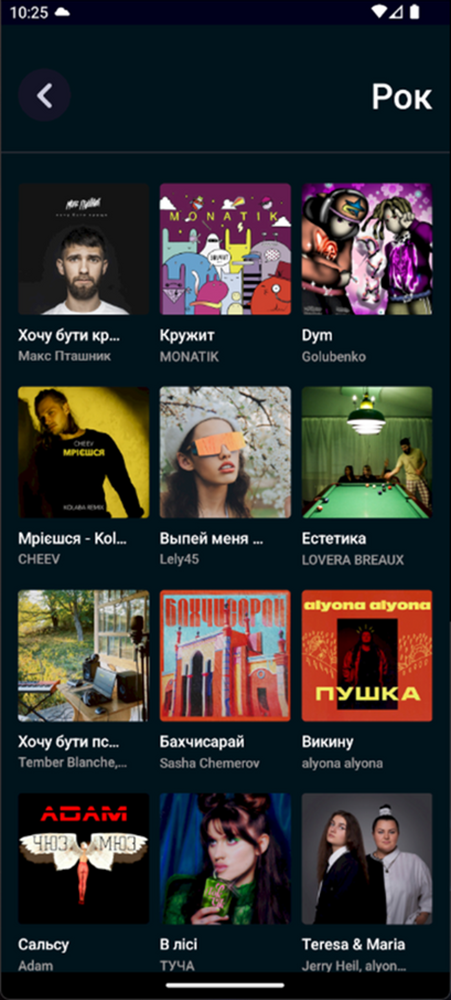

# :notes: Musua

Мобільний додаток для української музичної платформи
Зміст:
1. [Опис](#description)
2. [Теоретична база формування рекомендацій](#teoretical-reccomendations) 
3. [Технічна реалізація](#technical-realization)
    + [Проектування бази даних](#database-design)
    + [Оформлення кодової частини](#code)
    + [Аналіз backend-у](#backend)
    + [Аналіз API](#api)
    + [Аналіз frontend-у](#frontend)
4. [Готовий додаток](#full-stacked-app)

> [!NOTE]
> Цей проект не є готовим рішенням, що враховує усі нюанси процесу створення та підтримки подібного роду платформ. Він відображає лише ключові кроки розробки та може слугувати базою для подальшого розвитку.

---
## :memo: <span id="description" >1. Опис</span>

Додаток надає можлиливість ___прослуховувати треки українських виконавців і взаємодіяти із контентом___ - зберігати у обране та створювати власні плейлисти. Він містить _повну інформацію про пісні та виконавців_ - назви, жанри, роки випуску, альбоми та їх обкладинки, аудіо контент, популярність. Ці дані використовуються для вирішення ще одного базового завдання додатку - __підбір персональної системи рекомендацій користувача на основі його вподобань__. Для цього у базі також зберігаються особисті дані, такі як нікнейм, емейл, пароль для можливості створення свого власного акаунта.

---

## :thought_balloon: <span id="teoretical-reccomendations" >2. Теоретична база формування рекомендацій</span>

Найкращим досвідом у розробці рекомендаційного модуля є створення ___гібридної системи___ надання контенту, тобто формування рекомендацій відбувається як на основі дій користувача, так і на основі дій інших користувачів із подібними смаками - користувачів того ж кластера.

> [!TIP]
> __Кластеризація__ - це процес _групування_ схожих об'єктів разом.

Завдання <u>формування рекомендацій на основі вподобань</u> у даному випадку не є складною задачею і може включати у себе просту фільтрацію на основі схожості контенту.

А от <u>процес кластеризації</u> потребує більш детального аналізу. Виведемо основні моменти:
  + кількість користувачів та їхній обраний контент <u>_постійно змінюються_</u>
  + при формуванні рекомендацій потрібно враховувати <u>_частоту зустрічання_</u> того чи іншого виду контенту


Розглянемо 3 алгоритми кластеризації є:
  + [`K-Means`](https://www.analyticsvidhya.com/blog/2019/08/comprehensive-guide-k-means-clustering/) 
  + `DBSCAN`
  + `OPTICS`

#### `K-Means`

> Алгоритм `K-Means` вибирає K точок як центри кластерів, призначає кожен об'єкт до найближчого центру, обчислює нові центри кластерів як середнє значення об'єктів у кожному кластері, і повторює ці кроки, поки центри не перестануть змінюватися.

Ми могли би адаптувати `K-Means` таким чином, щоб ваги у ході поділу на групи враховувалися, тобто завдання _частоти зустрічання_ вирішити абсолютно реально, але от великою проблемою тут є потреба у наперед визначеній кількості кластерів (K) - це викликає потребу у наявності _алгоритма визначення найоптимальнішого значення K_. Цей процес є досить складним і ресурсозатратним, особливо у контексті такого рекомендаційного модуля - як вже було зазначено, кількість користувачів та їхні смаки постійно змінюються, а отже це оптимальне значення кількості кластерів увесь час має перераховуватися. 

Для прикладу, розглянемо алгоритм визначення оптимального числа кластерів під назвою `Метод ліктя`. 

> `Метод ліктя`: будується графік ___функції мінімізації___ (середньої квадратичної відстані від точок до центроїдів) в залежності від K. Зазвичай вибирають K, де графік показує значне уповільнення зменшення функції (_ліктьова точка_).

Отож, для визначення такого оптимального K довелося би перевірити достатньо велику кільість варіантів, і робити це кожного разу, коли інформація у БД про користувачів змінюється.

> [!TIP]
> `K-Means` не є оптимальним рішенням у задачах, де кількість кластерів не є сталою величиною або має адаптуватися під потреби дуже часто. Це зумовлено тим, що `K-Means` вимагає заздалегідь визначити кількість кластерів (K).

#### `DBSCAN`

> Алгоритм `DBSCAN` починає роботу з вибору випадкової точки із набору даних. Далі знаходить всі точки, що перебувають в заданій відстані (`eps`) від обраної. Якщо точок сусідів достатньо (більше мінімального порогу, `min_samples`), вони утворюють кластер. Алгоритм повторює _пошук сусідів_ для кожної точки в новому кластері, додаючи більше точок, якщо вони знаходяться в межах відстані `eps` і відповідають порогу `min_samples`. Ті точки, які не можуть бути приєднані до жодного кластера, позначаються як шум.

Цей алгоритм машинного навчання визначає кількість кластерів автоматично, але є важливий нюанс:
> [!TIP]
> Параметри `eps` (радіус сусідства) і `min_samples` (мінімальна кількість точок для утворення кластера) є фіксованими, тому __алгоритм працює добре, коли кластери мають однакову щільність__.

У нашому випадку це також є проблемою - не можна запевняти, що кількість людей, що слухатимуть рок і електроніку буде такою ж, як і тих, що слухатимуть поп із репом. Отож, цьому методу ___не хватає гнучкості у щільності визначення кластерів___.

#### `OPTICS`

> Алгоритм `OPTICS` починає роботу з вибору випадкової точки із набору даних. Для кожної точки обчислюються відстані до всіх інших, визначаючи мінімальну відстань (`core distance`) до точки, яка має не менше `min_samples` сусідів. Далі впорядковує всі точки на основі їх досяжності (`reachability distance`) від інших, починаючи з точки з найменшою відстанню до ядра. Алгоритм додає точки до впорядкування, розширюючи кластер до всіх точок у межах відстані `eps`, і повторює цей процес для кожної нової точки, якщо вона має достатню щільність (визначену параметром `min_samples`).

Отож __головна відмінність__ цього алгоритму від `DBSCAN` у тому, що його ___параметри не мають жорсткої фіксації___ - він виявляє кластери змінної щільності та потребує меншої кількості параметрів і менш чутливий до їх вибору, що є __ідеальним варіантом у завданнях рекомендаційної системи__.

> __Висновок__: для вирішення задач рекомендаційного модуля і врахування усіх особливостей системи найкращим варіантом є алгоритм кластеризації `OPTICS`.

---
## :computer: <span id="technical-realization">3. Технічна реалізація</span>

Для керування і взаємодії із базою даних було обрано СУБД MySQL. Бекенд частина написана на Python, фронтенд на ReactNativeJS, а для реалізації їх комунікації - Flask.

Розглянемо усі аспекти детальніше.

### <span id="database-design">3.1. Проектування бази даних</span>

Проаналізуємо, які таблиці були створені, їхні зв'язки та власне дані, які вони зберігають

#### Дані про музичний контент</span>


1. __`artists`__ - виконавці. Зберігає такі дані, як ім'я, популярність та фото. Дані, що є пов'язаними із виконавцем, це його альбоми та жанри.

2. __`albums`__ - альбоми. Містить дату випуску, загальну кількість треків, _тип_ та популярність. Під _типом_ тут мається на увазі чи це власне альбом, чи сингл. `album` може мати декілька виконавців і тоді виникає проблема взаємозв'язоку `"багато до багатьох" (M:M)`. Для її подолання тут створена проміжна таблиця `artist_albums`.
> [!WARNING]
> Зв'язки `"багато до багатьох" (M:M)` _створюють складності_ у структурі бази даних, оскільки один запис в одній таблиці може відповідати багатьом записам в іншій і навпаки. Для вирішення цієї проблеми використовують ___проміжні таблиці___, які розділяють `M` зв'язки на два зв'язки `"один до багатьох" (1:M).` 

3. __`songs`__ - пісні. Має такі поля як назва, тривалість, номер треку (в альбомі), аудіо (посилання на відривок), популярність. Також тут знаходиться _зовнішній ключ_ (FK) на індефікатор альбому (`album_id`).

4. __`genres`__ - жанри. Містить повне ім'я жанру (наприклад, hard rock) та коротку версію (rock). Це необхідно для того, щоб краще специфікувати _категорії_.

5. __`categories`__ - категорії. Містить свою назву (наприклад, _Рок_), та узагальнену (просту) назву жанру (наприклад, _rock_). У категоріях зберігатимуться плейлисти, альбоми та акаунти артистів загалом, що підпадають під певний жанр музики.

#### <span id="user-playlists-content">Дані про користувача. Організація контенту у плейлисти та обране</span>


1. __`playlists`__ - плейлисти. Має поля назва, опис, обкладинка, дата створення. У даному випадку наші плейлисти можуть бути створені Musua як публічні і зберігатися упевних категоріях контенту; можуть бути також створені Musua, але на основі смаків користувача і змога взаємодіяти із ними надаватиметься лише йому; і, звичайно, плейлисти можуть створювати самі користувачі. Для таких потреб тут додані поля у вигляді FK на id користувача - `id_user`, якщо цей плейлист _створений користувачем_ та `for_id_user`, якщо _плейлист створений для користувача_. 
2. __`users`__ - користувачі. Містить такі дані, як нікнейм, пароль, емейл. користувач може добавляти в обране такі дані:
   - __`user_favourite_albums`__ - альбоми
   - __`user_favourite_songs`__ - пісні
   - __`user_favourite_playlists`__ - плейлисти
3. __`playlists_tags`__ - теги плейлистів. Містить ідентифікатор плейлиста та його теги. Вони знадобляться для покращення системи підбору рекомендацій та створення контенту категорій.

> [!NOTE]
> Усі частини бази даних, де були наявні зв'язки `"багато до багатьох" (M:M)` були усунені ___проміжними таблицями___.` 

#### Наповнення бази даних
Наповнення інформації про користувача та його особистого контену і рекомендацій відбувається у ході користування самим додатком.
Заповнення музичної частини відбувається з допомогою [SpotifyAPI](https://developer.spotify.com/documentation/web-api)

> [!TIP]
> API _полегшує заповнення бази даних контентом_, автоматизуючи отримання та зберігання даних, що знижує потребу у ручному введенні. Вони _надають доступ до великих обсягів актуальної інформації, зменшують ймовірність помилок та спрощують інтеграцію з іншими системами._

> [SpotifyAPI](https://developer.spotify.com/documentation/web-api) дозволяє розробникам отримувати доступ до музичного каталогу Spotify, включаючи інформацію про треки, альбоми, виконавців, плейлісти та багато іншого.

Нижче наведена частина коду із __SpotifyAPI у Python__, яка використовувалася для заповнення БД:

```python
# функція отримує інформацію про треки за id альбому
def get_tracks_by_album(token, album_id):
    url = f"https://api.spotify.com/v1/albums/{album_id}/tracks"
    headers = get_auth_header(token)
    params = {
        "limit": 50,
    }

    result = get(url, headers=headers, params=params)
    json_result = json.loads(result.content)

    if 'error' in json_result:
        return get_tracks_by_album(get_token(), album_id)

    tracks_info = []
    for item in json_result['items']:
        track_id = item['id']
        track_name = item['name']
        track_duration_ms = item['duration_ms']
        track_number = item['track_number']
        if item["preview_url"]: track_preview_url = item["preview_url"][30:70]
        else: track_preview_url = None
        track_artists = [artist['id'] for artist in item['artists']]

        tracks_info.append({
            'track_id': track_id,
            'track_name': track_name,
            'track_duration_ms': track_duration_ms,
            'track_number': track_number,
            'track_preview_url': track_preview_url,
            'track_artists': track_artists,
        })

    return tracks_info
```

---

### :file_folder: 3.2. <span id="code">Оформлення кодової частини</span>

Базова структура директорій:
```
.
├── frontend
│   ├── ...
│   └── ...
├── spotifyapi
│   ├── app.py
│   ├── get_data.py
│   ├── manage_data.py
│   ├── order_data.py
│   ├── convert_data.py
│   ├── content_data.py
│   ├── user.py
│   ├── filler.py
│   ├── recommendations.py
│   └── fake_data.py
└── README.md
```

Тобто ми зберігаємо окремо frontend та backend частини.

> [!NOTE]
> Усі файли backend частини у папці `spotifyapi` містять функції, що вказують, як взаємоіяти із базою даних - вони шукають та повертають дані, вносять зміни, добавляють інформацію тощо, окрім файлу `app.py` - він _має конфігурацію для з'єднання до БД_ і містить `API` самого додатку.

> [!TIP]
> У ході розгортання великої кількості функцій при створенні подібних проектів може виникати некоретна робота коду. Нерідко джерело таких проблем є важким для відслідковування. Для цього їх пошук варто починати із менш незалежних частин. Наприклад, перевірити з'єднання та правильність вказаного шляху API. Це можна зробити за допомогою програм, що тестують API-запити, надають можлиливість переглядати відповіді та діагностувати проблеми. При створенні цього продукту для такої діагностики використовувалася програма [Postman](https://www.postman.com/jp/downloads/)

### :wrench: 3.3. <span id="backend">Аналіз backend-у</span>

##### get_data.py
`get_data.py` містить функції, що дістають необхідний контент із бази даних. Наприклад, нижче наведена функція, що дістає пісні за ідентифікатором альбому`album_id`.

```python
""" --- GET SONGS BY ALBUM ---
data structure:
album_id
--------------------------------"""
def get_songs_by_album(cursor, album_id):    
    get_songs_by_album_query = """
        SELECT id
        FROM songs
        WHERE id_album = %s
    """
    values = (album_id,)
    
    try:
        cursor.execute(get_songs_by_album_query, values)
        
        rows = cursor.fetchall()
        song_ids = [row[0] for row in rows]

    except Error as e:
        return f"Error -> get_songs_by_album : {e}. Most likely album_id is incorrect"
            
    return song_ids
```

> [!TIP]
> Для попередження викидів із програми більшість функцій мають обгортку `try ... except` для коректного оброблення помилок.

##### manage_data.py
`manage_data.py` містить функції, що обробляють музичний контент - створюють плейлисти, видаляють/добавляють в обране тощо. Наприклад, нижче наведена функція, що добавляє пісні до плейлиста(-ів).

```python
""" -------- ADD SONGS TO PLAYLISTS --------
data structure:
'data':{
    'playlist_ids' : [playlist_id, playlist_id, ...]
    'song_ids' : [song_id, song_id, ...]
    }
-----------------------------------------------------------"""
def add_songs_to_playlists(cursor, data):
    playlist_ids = data['playlist_ids']
    song_ids     = data['song_ids']
    insert_date  = datetime.now().strftime('%Y-%m-%d %H:%M:%S')
                
    check_query = f"""
        SELECT EXISTS (
        SELECT 1
        FROM playlist_songs
        WHERE id_playlist = %s AND id_song = %s
        );
    """
    add_song_to_playlist_query = f"""
        INSERT INTO playlist_songs (id_playlist, id_song, insert_date)
        VALUES (%s, %s, %s)
    """
    
    try: 
        for playlist_id in playlist_ids:
            for song_id in song_ids:
                cursor.execute(check_query, (playlist_id, song_id))            
                if cursor.fetchone()[0] == 0:
                    cursor.execute(add_song_to_playlist_query, (playlist_id, song_id, insert_date))
    except Error as e:
        return f"Error -> add_songs_to_playlists : {e}"
    
    return "Song is successfuly added"
```

##### order_data.py
`order_data.py` містить функції, що повертають контент відсортованим за певним параметром. Наприклад:

```python
# Сортування пісень за тривалістю
def sort_songs_by_duration_ms(songs_data, reverse=False):
    return sorted(songs_data, key=lambda x: x["song"]["duration_ms"], reverse=reverse)
```

##### convert_data.py
`convert_data.py` містить деякі функції, що конвертують дані у певний вигляд. Наприклад:

```python
# Конвертує рядок у форматі дати (YYYY-MM-DD) 
def convert_into_date(date):
    try:
        converted_date = datetime.strptime(date, '%Y-%m-%d').date()
        return converted_date.strftime('%Y-%m-%d')
    except ValueError:
        return None
```

##### content_data.py
`content_data.py` також містить функції, що дістають дані, але ця інформація є більш комплексною і потрібна для створення рекомендаційного контенту - наприклад, дістати 100 найпопулярніших виконавців, повернути пісні, що написані у жанрі рок тощо.

```python
# Повертає виконавців вказаних жанрів 
def get_artists_ids_by_genres(cursor, genres): 
    try: 
        genre_placeholders = ','.join(['%s' for _ in genres])
        get_genre_id_by_name_query = f"""
            SELECT id
            FROM genres
            WHERE name IN ({genre_placeholders})
        """
        cursor.execute(get_genre_id_by_name_query, genres)
        rows = cursor.fetchall()
        genre_ids = [row[0] for row in rows]
        if not genre_ids: return "genres names are invalid"
        
        
        genre_ids_placeholders = ','.join(['%s' for _ in genre_ids])
        get_artist_ids_by_genre_id_query = f"""
            SELECT id_artist
            FROM artist_genres
            WHERE id_genre IN ({genre_ids_placeholders})
        """
        cursor.execute(get_artist_ids_by_genre_id_query, genre_ids)
        rows = cursor.fetchall()
        artist_ids = [row[0] for row in rows]
    
        return artist_ids
    
    except Error as e:
        return f"Error -> get_artists_ids_by_genres : {e}"
```

##### user.py
`user.py` - керує користувацьким контентом - реєстрація, вхід, видалення акаунта.

```python
# Вхід в акаунт
def sign_in_user_account(cursor, data):
    password = data['password']
    email    = data['email']
    
    password = hash_password(password)
    
    user_info_query = """SELECT id, nickname, email
        FROM users
        WHERE email = %s AND password = %s 
    """
    values = (email, password)
    
    try:
        cursor.execute(user_info_query, values)
        row = cursor.fetchone()
        
        user_info = {}
        if row:
            user_info['user_id']    = row[0]
            user_info['nickname']   = row[1]
            user_info['email']      = row[2]
        return user_info
    except Error as e:
        return f"Error: -> sign_in_user_account : {e}. Most likely user doesn't exist"
```

##### filler.py
`filler.py` - функції заповнення бази даних музичним контентом.

##### recommendations.py
`recommendations.py` - функції формування рекомендаційного контенту. Розглянемо це детальніше.

###### 1. Отримання смаків користувача
Перш ніж формувати рекомендації, необхідно знати на основі чого це робити. Нижче наведена функція, що аналізує вподобаний контент:

```python
def get_user_tastes_data(cursor, user_id):

    favourite_songs_ids     = get_songs_from_favourite(cursor, user_id)
    favourite_albums_ids    = get_albums_from_favourite(cursor, user_id)
    favourite_playlists_ids = get_playlists_from_favourite(cursor, user_id)
    
    songs_ids = set()
    
    #  ------------------------------------------------------------------
    if favourite_songs_ids:
        for album_id in favourite_albums_ids:
            songs_ids.update(get_songs_by_album(cursor, album_id))
    
    if favourite_playlists_ids:
        for playlist_id in favourite_playlists_ids:
            songs_ids.update(get_songs_by_playlist(cursor, playlist_id))
        
    if not songs_ids: return False
    
    songs_ids = list(songs_ids)

    full_artist_ids = []
    for song_id in songs_ids:
        full_artist_ids.append(get_artist_by_song(cursor, song_id))
        
    artist_ids = list(set(full_artist_ids))
     
    genres = []
    for artist_id in full_artist_ids:
        genres_by_artist = get_genres_by_artist(cursor, artist_id)
        if genres_by_artist is not None:
            genres += genres_by_artist

    Q1 = np.percentile(genres, 30)
    Q3 = np.percentile(genres, 70)
    IQR = Q3 - Q1
    
    lower_bound = Q1 - 1.5 * IQR
    upper_bound = Q3 + 1.5 * IQR

    genres_without_outliers = [x for x in genres if x >= lower_bound and x <= upper_bound]
    
    data = {
        'user_id'    : user_id,
        'genres_ids' : genres_without_outliers,
        'artist_ids' : artist_ids,
        'songs_ids'  : songs_ids,
        'full_artist_ids'         : full_artist_ids,
        'favourite_albums_ids'    : favourite_albums_ids,
        'favourite_playlists_ids' : favourite_playlists_ids
    }
    
    return data
```

Вона повертає ідентифікатори виконавців, пісень, альбомів та плейлистів, а також жанрів, які попередньо були очищені з використанням квантилів:

```python
    Q1 = np.percentile(genres, 30)
    Q3 = np.percentile(genres, 70)
    IQR = Q3 - Q1
    
    lower_bound = Q1 - 1.5 * IQR
    upper_bound = Q3 + 1.5 * IQR

    genres_without_outliers = [x for x in genres if x >= lower_bound and x <= upper_bound]
```

> [!NOTE]
> Очищення жанрів від викидів тут потрібне для того, щоб аналізувати лише ті, які найчастіше прослуховуються і покращити процес підбору рекомендацій.

###### 2. Формування рекомендацій на основі кластеризації

У пункті [Теоретична база формування рекомендацій](#teoretical-reccomendations) ми вже проаналізували різні алгоритми кластеризації, їхні недоліки та визначили найкращий варіант - `OPTICS`. Нижче наведена реалізація його використання:

```python
def create_recommendations_OPTICS(cursor, main_user_data, min_samples=3):
    user_id = main_user_data['user_id']

    get_all_users_query = """SELECT id FROM users"""
    cursor.execute(get_all_users_query)
    rows = cursor.fetchall()
    user_ids = [row[0] for row in rows if row[0] != user_id]
    all_users_tastes = [main_user_data]
    user_ids_copy = user_ids
    
    for some_user_id in user_ids_copy:
        user_tastes_data = get_user_tastes_data(cursor, some_user_id)
        if not user_tastes_data: 
            user_ids.remove(some_user_id)
            continue
        all_users_tastes.append(user_tastes_data)

    le = LabelEncoder()
    all_artists_with_outliers = [artist_id for user_data in all_users_tastes for artist_id in user_data['artist_ids']]
    le.fit(all_artists_with_outliers)

    cleaned_user_data = []
    for user_data in all_users_tastes:
        cleaned_artist_ids = remove_outliers([le.transform([artist_id])[0] for artist_id in user_data['artist_ids']])
        cleaned_user_data.append({'artist_ids': cleaned_artist_ids})

    artist_matrix = [user_data['artist_ids'] for user_data in cleaned_user_data]

    max_length = max(len(row) for row in artist_matrix)

    avg_values = np.mean([row + [0] * (max_length - len(row)) for row in artist_matrix], axis=0)
    artist_matrix_padded = [row + list(avg_values[len(row):]) for row in artist_matrix]

    optics = OPTICS(min_samples=min_samples)
    optics.fit(artist_matrix_padded)
    main_user_cluster = optics.labels_[0]

    similar_users = [i for i, cluster in enumerate(optics.labels_) if cluster == main_user_cluster]
    similar_users_data = [all_users_tastes[i] for i in similar_users]

    recommended_artists = set()
    for user_data in similar_users_data:
        for artist_id in user_data['artist_ids']:
            if artist_id not in main_user_data['artist_ids']:
                recommended_artists.add(artist_id)

    recommended_artists = sorted(recommended_artists, key=lambda x: [user_data['artist_ids'].index(x) for user_data in similar_users_data if x in user_data['artist_ids']][0])

    return recommended_artists
```

Розберемо кроки детальніше:

###### 2.1. Ініціалізація та отримання даних:
```python
user_id = main_user_data['user_id']
get_all_users_query = """SELECT id FROM users"""
cursor.execute(get_all_users_query)
rows = cursor.fetchall()
user_ids = [row[0] for row in rows if row[0] != user_id]
all_users_tastes = [main_user_data]
user_ids_copy = user_ids
```
  + Отримуємо ID всіх користувачів, окрім головного (його смаки `main_user_data` вже були передані у функцію).
  + Створюємо список all_users_tastes, починаючи з даних головного користувача.

###### 2.2. Збір даних про смаки користувачів:

```python
for some_user_id in user_ids_copy:
    user_tastes_data = get_user_tastes_data(cursor, some_user_id)
    if not user_tastes_data: 
        user_ids.remove(some_user_id)
        continue
    all_users_tastes.append(user_tastes_data)
```
  + Збираємо дані про смаки кожного користувача.
  + Якщо дані відсутні, видаляємо користувача зі списку.

###### 2.3. Кодування артистів:

```python
le = LabelEncoder()
all_artists_with_outliers = [artist_id for user_data in all_users_tastes for artist_id in user_data['artist_ids']]
le.fit(all_artists_with_outliers)
```

  + Використовуємо LabelEncoder для перетворення ID артистів у числові значення.

> [!TIP]
> Багато алгоритмів машинного навчання, включаючи `OPTICS`, працюють з _числовими даними_. ID артистів, у нашому випадку, є текстовими рядками, а не числовими ідентифікаторами - їх ID відповідають тим ID, які зберігаються у `Spotify`, і саме їх ми отримали через `SpotifyAPI`. 
>
>Такий спосіб зберігання даних є оптимальним рішенням із розрахунку на майбутнє (наприклад, при обновленні інформації про артистів - добавити новий альбом, змінити фото тощо), оскільки у БД напряму зберігаються валідні для запиту `SpotifyAPI` ідентифікатори. 

> [!NOTE]
>Не лише виконавці мають рядковий ідентифікатор - інші дані, такі як _пісні та альбоми_, інформацію про яких теж було здобуто через `SpotifyAPI`, мають такого типу ID.

###### 2.4. Видалення викидів та очищення даних:

```python
def remove_outliers(data):
    Q1 = np.percentile(data, 25)
    Q3 = np.percentile(data, 75)
    IQR = Q3 - Q1
    lower_bound = Q1 - 1.5 * IQR
    upper_bound = Q3 + 1.5 * IQR
    cleaned_data = [x for x in data if lower_bound <= x <= upper_bound]
    return cleaned_data
```

```python
cleaned_user_data = []
for user_data in all_users_tastes:
    cleaned_artist_ids = remove_outliers([le.transform([artist_id])[0] for artist_id in user_data['artist_ids']])
    cleaned_user_data.append({'artist_ids': cleaned_artist_ids})
```

> __Викиди даних__ — це точки, які значно відрізняються від інших точок у наборі даних. Вони можуть бути результатом помилок вимірювання, вводу даних або справжніми аномаліями.

> [!TIP]
> Усунення викидів необхідно для:
> - Покращення якості даних
> - Усунення шуму
> Зокрема квантилі допомагають зрозуміти розподіл даних, виявити ці викиди та усунути їх.

###### 2.5. Створення матриці артистів:
```python
artist_matrix = [user_data['artist_ids'] for user_data in cleaned_user_data]
max_length = max(len(row) for row in artist_matrix)
avg_values = np.mean([row + [0] * (max_length - len(row)) for row in artist_matrix], axis=0)
artist_matrix_padded = [row + list(avg_values[len(row):]) for row in artist_matrix]
```

> [!NOTE]
> Тут ми створюємо ___матрицю однакової довжини___ для всіх користувачів. Інакше відсутні значення могли би спотворити дані, а також імовірна різна кількість артистів призводила б до проблем у роботі `OPTICS`:
>  - `OPTICS` очікує, що __всі вхідні вектори__ (у нашому випадку - списки артистів для кожного користувача) матимуть __однакову довжину__. 

###### 2.6. Застосування алгоритму OPTICS:
```python
optics = OPTICS(min_samples=min_samples)
optics.fit(artist_matrix_padded)
main_user_cluster = optics.labels_[0]
```

###### 2.7. Пошук схожих користувачів:
```python
similar_users = [i for i, cluster in enumerate(optics.labels_) if cluster == main_user_cluster]
similar_users_data = [all_users_tastes[i] for i in similar_users]
```

###### 2.8. Формування рекомендацій:
```python
recommended_artists = set()
for user_data in similar_users_data:
    for artist_id in user_data['artist_ids']:
        if artist_id not in main_user_data['artist_ids']:
            recommended_artists.add(artist_id)
```

Ми отримуємо список _нових_ для користувача артистів

###### 2.9. Сортування рекомендацій:
```python
recommended_artists = sorted(recommended_artists, key=lambda x: [user_data['artist_ids'].index(x) for user_data in similar_users_data if x in user_data['artist_ids']][0])
```

> Логіка цього сортування така:
> - Артисти, які зустрічаються у більшої кількості схожих користувачів, матимуть більше шансів отримати менший індекс.
> - Таким чином, сортування фактично віддає перевагу артистам, які більш поширені серед схожих користувачів.

> [!NOTE]
> У даному випадку ми підбираємо контент саме за ___виконавцями___, тому що від них у нас є подальший __доступ до інших видів даних__ - пісень, альбомів, жанрів. Алгоритм у будь-якому випадку є _ресурсозатратним_, особливо із збільшенням музичної бази та кількості користувачів у перспективі, тому його виконання лише по одному критерію, від результатів якого можна відштовхнутися у _формуванні більш складного контенту_, при такій ситуації є досить оптимальним.

___Висновки:___
Ця функція створює рекомендації на основні кластерного аналізу, використовуючи алгоритм `OPTICS`. Тут враховуються такі нюанси, як:
- попередня прослуховуваність артистів користувача - рекомендується новий контент
- частота зустрічання різних виконавців в інших користувачів того ж кластера, щоб до рекомендацій увійшов найбільш популярний контент

###### 3. Створення персональних плейлистів користувача:
```python
def create_recommended_playlist_for_user(cursor, data):
    user_id    = data['user_id']
    artist_ids = data['artist_ids']
    song_ids   = data['songs_ids']
    
    # Збір нових пісень
    new_songs_ids = []
    for artist_id in artist_ids:
        artist_songs = get_songs_by_artist(cursor, artist_id)
        new_songs = [song for song in artist_songs if song not in song_ids]
        new_songs_ids += new_songs
        
    new_songs_ids = list(set(new_songs_ids))
    
    # Групування пісень за жанрами
    genre_to_songs = {}
    for song_id in new_songs_ids:
        song_genres = get_genres_by_song(cursor, song_id)
        if song_genres == None: continue
        for genre in song_genres:
            if genre not in genre_to_songs:
                genre_to_songs[genre] = []
            genre_to_songs[genre].append(song_id)
    
    # Створення плейлистів:
    playlists = []
    get_genre_name_by_id_query = """
        SELECT name
        FROM genres
        WHERE id=%s
    """
    for genre_id, songs_ids in genre_to_songs.items():
        cursor.execute(get_genre_name_by_id_query, (genre_id,))
        genre_name = cursor.fetchone()[0]
        playlist_data = {
            'name'        : f"Найкраще у жанрі {genre_name} для Вас",
            'description' : None,
            'cover'       : 1,
            'user_id'     : None,
            'for_user_id' : user_id
        }
        playlist_id = create_playlist(cursor, playlist_data)
        
        random.shuffle(songs_ids)
        length = min(len(songs_ids), 100)
        songs_ids = songs_ids[:length]
        
        playlist_songs_data = {
            'playlist_ids' : [playlist_id],
            'song_ids'     : songs_ids
        }
        add_songs_to_playlists(cursor, playlist_songs_data)

    # Повернення список ID новостворених плейлистів.
    get_new_playlists_query = """
        SELECT id
        FROM playlists
        WHERE for_user_id=%s
    """
    cursor.execute(get_new_playlists_query, (user_id,))
    new_playlist_ids = [row[0] for row in cursor.fetchall()]

    return new_playlist_ids
```

Ця функція створює плейлисти користувача на основі рекомендованих виконавців, список `ID` яких можна получити через функцію `create_recommendations_OPTICS`. ЇЇ основні кроки:
  - збирає `ID` пісень вказаних виконавців
  - сортує ці пісні за жанрами
  - створює плейлисти, наповнюючи їх відповіними піснями
  - збирає `ID` усіх плейлистів, що були створені для користувача (поле `for_user_id`)

> [!TIP]
> При створенні плейлиста у базу даних вноситься і позначка дати. Припустимо, що для користувача згенерувалося 5 персоналізованих плейлистів. Можна, орієнтуючись на цю дату створення плейлиста із відповідним `for_user_id` при перевершенні його часу існування в якийсь термін `T` видаляти дані із БД при умові, що плейлист не з'явився у вподобаних користувача. Таким чином це надасть механізм очистки тимчасової інформації. Ось __приклад функції__, що може це робити:

```python
def delete_old_recommended_user_playlists(cursor, user_id):
    favourite_playlists_ids = get_playlists_from_favourite(cursor, user_id)
    get_playlist_ids_query = """
        SELECT id
        FROM playlists
        WHERE for_user_id=%s
    """
    
    cursor.execute(get_playlist_ids_query, (user_id,))
    rows = cursor.fetchall()
    playlist_ids_for_user = [row[0] for row in rows]
    
    for playlist_id in playlist_ids_for_user:
        if playlist_id not in favourite_playlists_ids:
            delete_playlist(cursor, playlist_id)
    return True
```

###### 4. Створення музичних міксів користувача

```python
def create_user_best_mixes(cursor, user_id, user_songs_ids):
    genre_to_songs = {}
    for song_id in user_songs_ids:
        song_genres = get_genres_by_song(cursor, song_id)
        if song_genres is None: continue
        for genre in song_genres:
            if genre not in genre_to_songs:
                genre_to_songs[genre] = []
            genre_to_songs[genre].append(song_id)
    playlists = []
        
    get_genre_name_by_id_query = """
        SELECT name
        FROM genres
        WHERE id=%s
    """
    for genre_id, songs_ids in genre_to_songs.items():
        cursor.execute(get_genre_name_by_id_query, (genre_id,))
        genre_name = cursor.fetchone()[0]
        playlist_data = {
            'name'        : f"Твої найкращі мікси у жанрі {genre_name}",
            'description' : None,
            'cover'       : 1,
            'user_id'     : None,
            'for_user_id' : user_id
        }
        playlist_id = create_playlist(cursor, playlist_data)
        
        random.shuffle(songs_ids)
        length = min(len(songs_ids), 100)
        songs_ids = songs_ids[:length]
        
        playlist_songs_data = {
            'playlist_ids' : [playlist_id],
            'song_ids'     : songs_ids
        }
        add_songs_to_playlists(cursor, playlist_songs_data)

    get_new_playlists_query = """
        SELECT id
        FROM playlists
        WHERE for_user_id=%s
    """
    cursor.execute(get_new_playlists_query, (user_id,))
    new_playlist_ids = [row[0] for row in cursor.fetchall()]

    return new_playlist_ids
```

Функція діє за схожим принципом до `create_recommended_playlist_for_user`, але її робота зразу базується на вподобаних піснях користувача:
  - збирає жанри пісень і групує за ними
  - створює плейлисти за жанровими ознаками
  - повертає індефікатори плейлистів

###### 5. Рекомендації контенту за виконавцем

###### 5.1. Альбоми
```python
def reccomend_albums_by_artist(cursor, full_artist_ids, albums_ids):
    # Сортує виконавців за частоттою їз зустрічання
    artist_count = Counter(full_artist_ids)
    sorted_artist_ids = [artist_id for artist_id, count in artist_count.most_common()]

    # створює словник рекомендованих альбомів для кожного виконавця
    artist_albums = {}
    for artist_id in sorted_artist_ids:
        albums = get_albums_by_artist(cursor, artist_id)
        filtered_albums = [album_id for album_id in albums if album_id not in albums_ids] 
        if filtered_albums:
            artist_albums[artist_id] = filtered_albums

    return artist_albums
```

Основна мета цієї функції - вибрати альбоми виконавців, які ще не знайомі користувачеві.

###### 5.2. Пісні
```python
def reccomend_songs_by_artist(cursor, full_artist_ids, albums_ids):
    artist_albums = reccomend_albums_by_artist(cursor, full_artist_ids, albums_ids)
    song_ids = set()
    for album_id in artist_albums:
        song_ids.update(get_songs_by_album(cursor, album_id))
    return list(song_ids)
```

Функція є доповненням попередньої - повертає пісні обраних альбомів.

###### 6. Готові плейлисти категорій
```python
def recommend_categories_playlists(cursor, genres_ids):
    # сортує жанри за частотою зустрічання
    genre_count = Counter(genres_ids)
    sorted_unique_genres_ids = [genre for genre, count in genre_count.most_common()]
    
    number = min(len(sorted_unique_genres_ids), 3)
    sorted_unique_genres_ids = sorted_unique_genres_ids[:number]

    sorted_genres_names = tuple()
    for genre_id in sorted_unique_genres_ids:
        genre_name = get_genre_name_by_genre_id(cursor, genre_id)
        sorted_genres_names += (genre_name,)

    # обирає плейлисти, теги категорій яких відповідають назвам категорій
    playlist_ids = set()

    placeholders = ', '.join(['%s'] * len(sorted_genres_names))
    get_id_playlist_by_tag_query = f"""
    SELECT id_playlist
    FROM playlist_tags
    WHERE tag IN ({placeholders})
    """

    cursor.execute(get_id_playlist_by_tag_query, sorted_genres_names)

    results = cursor.fetchall()
    for row in results:
        playlist_ids.add(row[0]) 

    return list(playlist_ids)
```

Функція повертає готові плейлисти створені додатком, що відповідають жанровим смакам користувача.

###### 7. Базові рекомендації популярного контенту
```python
def create_basic_reccomendations(cursor):
    artists_ids  = get_most_popular_artists_overall(cursor, 15)
    albums_ids   = get_most_popular_albums_overall(cursor, 15)
    playlist_ids = get_most_popular_playlists_overall(cursor, 15)
    
    song_ids = set()
    for album_id in albums_ids:
        song_ids.update(get_songs_by_album(cursor, album_id))
    popular_songs = get_most_popular_songs(cursor, song_ids)
    
    songs_data = []
    for song_id in popular_songs:
        songs_data.append(get_song_info(cursor, song_id))
    artists_data = []
    for artist_id in artists_ids:
        artists_data.append(get_artist_info(cursor, artist_id))
    playlists_data = []
    for playlist_id in playlist_ids:
        playlist_data = get_playlist_info(cursor, playlist_id)
        if playlist_data['songs_count'] > 0:
            playlists_data.append(playlist_data)
    
    random.shuffle(playlists_data)
    random.shuffle(artists_data)
    random.shuffle(songs_data)
    
    reccomendations = [
        {'type' : 'Playlist',   'title' : 'Варто послухати',     'data' : playlists_data},
        {'type' : 'Artist',     'title' : 'Популярні виконавці', 'data' : artists_data},
        {'type' : 'Song',       'title' : 'Топ крутих пісень',   'data' : songs_data},
    ]
    return reccomendations
```

Функція повертає інформацію про найпопулярніші альбоми, плейлисти і виконавців.

###### Узагальнене формування рекомендаційного контенту
Функція, що наведена нижче, узагальнює та скоординовує роботу усіх попередніх, формуючи повноцінний рекомендаційний контент із відповідною додатковою інформацією.

```python
def create_complex_reccomendations(cursor, user_id):
    return create_basic_reccomendations(cursor)

    main_user_data = get_user_tastes_data(cursor, user_id)

    if not main_user_data or not main_user_data['songs_ids']:
        return create_basic_reccomendations(cursor)
    #  ВИПРАВИТИ
    base = create_basic_reccomendations(cursor)

    reccomendations = []

    # reccomend artists
    recommended_artists = create_recommendations_OPTICS(cursor, main_user_data)
    create_recommended_playlist_data = {
        'user_id'    : user_id,
        'artist_ids' : recommended_artists,
        'songs_ids'  : main_user_data['songs_ids']
    }
    data  = recommended_artists
    title = 'Відкрийте для себе нових виконавців'
    if data: reccomendations.append({
        'type'  : 'Artist',
        'data'  : data,
        'title' : title
    })
    else: return base
    
    # create reccomend playlists
    data  = create_recommended_playlist_for_user(cursor, create_recommended_playlist_data)
    title = 'Спеціально для Вас'
    if data: reccomendations.append({
        'type'  : 'Playlist',
        'data'  : data,
        'title' : title
    })
    
    # reccomend albums
    data  = reccomend_songs_by_artist(cursor, main_user_data['full_artist_ids'], main_user_data['favourite_albums_ids'])
    title = 'Ці треки Вам точно сподобаються'
    if data: reccomendations.append({
        'type'  : 'Song',
        'data'  : data,
        'title' : title
    })

    #  create user best mixes
    data  = create_user_best_mixes(cursor, user_id, main_user_data['songs_ids'])
    title = 'Ваші найкращі мікси'
    if data: reccomendations.append({
        'type'  : 'Playlist',
        'data'  : data,
        'title' : title
    })
    
    # genre recomandations playlists
    data  = recommend_categories_playlists(cursor, main_user_data['genres_ids'])
    title = 'У Ваших улюблених жанрах'
    if data: reccomendations.append({
        'type'  : 'Playlist',
        'data'  : data,
        'title' : title
    })

    return base+reccomendations
```

##### fake_data.py
Для того, щоб на практиці перевірити, як працює процес створення рекомендацій, потрібно мати певну базу користувачів. Функції `fake_data.py` заповнюють БД певними псевдорандомними даними, за якими користувачів можна розділити у кластери.

### :speaker: 3.4. <span id="api">Аналіз API</span>
`API` міститься у файлі `api.py`. Його функціонал відповідає за підключення до БД та виконання запитів до неї - він виконує роль інтерфейсу для додатку. Його завдання:
  - Визначення маршрутів (routes): кожен декоратор `@app.route()` визначає URL-шлях, за яким клієнт може звернутися до певної функціональності.
  - Обробка HTTP-запитів
  - Виклик відповідних функцій
  - Формування відповіді
  - Забезпечення взаємодії - створює спосіб комунікації між клієнтом і сервером, дозволяючи їм обмінюватися даними у зрозумілому для обох сторін форматі.

> Для цього завдання було створено API за допомогою Flask - це легкий, гнучкий та зрозумілий у використанні веб-фреймворк для Python.

###### 1. Ініціалізація Flask-додатку. Конфігурація бази даних.

```python
# CREATE APP
app = Flask(__name__)
CORS(app)

app.config['SQLALCHEMY_DATABASE_URI']        = 'mysql://root:@localhost/muzua'
app.config['SQLALCHEMY_TRACK_MODIFICATIONS'] = False
app.config['JSONIFY_PRETTYPRINT_REGULAR']    = False

db = SQLAlchemy(app)
```

###### 2. Створення `route-url` для запитів.

> [!TIP]
> Ми використовуватимемо 2 основні види запитів: `POST` та `GET`.
> `GET`:
>  - Використовуються для отримання даних з сервера.
>  - Параметри передаються в URL
>
> `POST`:
>  - Використовуються для відправки даних на сервер для обробки.
>  - Дані передаються в тілі запиту, а не в URL.
>  - Більш безпечні для передачі конфіденційної інформації.

Розглянемо приклади їх використання із файлу `app.py`:

###### GET

```python
@app.route('/api/songs_from_favourite/<user_id>', methods=['GET'])
def get_songs_from_favourite_endpoint(user_id):
    cursor = db.engine.raw_connection().cursor()
    result = get_songs_from_favourite(cursor, user_id)
    cursor.close()
    return jsonify(result)
```

Ця функція повертає улюблені пісні користувача із заданим `user_id`:
  - ```@app.route('/api/songs_from_favourite/<user_id>', methods=['GET'])``` формує посилання `/api/songs_from_favourite/<user_id>` де `user_id` береться у `<...>` для того, щоб вказати, що цей параметр підставляється. У `methods` вказаний єдиний метод `GET`
  - далі до `функції endpoint-у` передається як аргумент `user_id`.
  - у тілі функції встановлюється зв'язок до БД, отримується результат через функцію `get_songs_from_favourite` (імпортована з файлу `get.py`) і зв'язок закривається
  - результат повертається у форматі `json`: `jsonify(result)`

> [!TIP]
> Можна вказувати тип даних у запиті, наприклад:
```python
@app.route('/api/playlists_full_info_from_favourite/<string:user_id>/<int:limit>', methods=['GET'])
def get_playlists_full_info_from_favourite_endpoint(user_id, limit):
    cursor = db.engine.raw_connection().cursor()
    result = get_playlists_full_info_from_favourite(cursor, user_id, limit)
    cursor.close()
    return jsonify(result)
```

> [!TIP]
> `JSON (JavaScript Object Notation)` - формат обміну даними. Представляє дані у _вигляді пар "ключ-значення" та впорядкованих списків_. __Він забезпечує стандартний формат для обміну даними між клієнтом і сервером.__ Легко розширюється і модифікується без порушення існуючих структур. Це значно спрощує усі аспекти процесу обміну даними.

###### POST

``` python
@app.route('/api/add/favourite/', methods=['POST'])
def add_music_to_favourite_endpoint():
    cursor = db.engine.raw_connection().cursor()
    data = request.get_json()
    result = add_music_to_favourite(cursor, data)
    cursor.connection.commit()
    cursor.close()
    return jsonify(result)
```

Ця функція добавляє музичний контент в обране. 
  - тут ми вже отримуємо дані від клієнта: ```data = request.get_json()```, що поступили у форматі `json`
  - потім використовуємо їх функції `add_music_to_favourite`
  - комітимо зміни та закриваємо з'єднання
  - повертаємо `jsonify(result)`

 Ось як виглядає сама функція `add_music_to_favourite`:

```python
""" -------- ADD SONGS, ALBUMS OR PLAYLISTS TO FAVOURITE --------
data structure:
'data':{
    'user_id' : user_id,
    'music_ids' : [music_id, music_id, ...],
    'music_type' : music_type }
music_type: 'song', 'album', 'playlist'
-----------------------------------------------------------"""
def add_music_to_favourite(cursor, data):
    
    user_id    = data['user_id']
    music_ids  = data['music_ids']
    music_type = data['music_type']
    
    if music_type not in ['song', 'album', 'playlist']:
        raise ValueError("Incorrect music type")

    table = f"user_favourite_{music_type}s"
    
    check_query = f"""
        SELECT EXISTS (
        SELECT 1
        FROM {table}
        WHERE id_user = %s AND id_{music_type} = %s
        );
    """
    insert_music_query = f"""
        INSERT INTO {table} (id_user, id_{music_type})
        VALUES (%s, %s)
    """
    
    try: 
        for music_id in music_ids:
            values = (user_id, music_id)
            cursor.execute(check_query, values)
            if cursor.fetchone()[0] == 0: cursor.execute(insert_music_query, values)
    except Error as e: 
        return f"Error -> add_music_to_favourite : {e}. Most likely music_ids and music_type have different types"
    
    return "Music is added"
```
Тоді ось як виглядатиме приклад `data = request.get_json()`, яку ми формуємо у `json` форматі на стороні клієнта:
```json
{
  "data": {
    "user_id": 1,
    "music_ids": ["song_id_1", "song_id_2", "song_id_3"],
    "music_type": "song"
  }
}
```

###### GET+POST
`GET` та `POST` можна використовувати разом, наприклад:
```python
@app.route('/api/most_popular_songs/<number>', methods=['POST', 'GET'])
def get_most_popular_songs_endpoint(number):
    cursor = db.engine.raw_connection().cursor()
    data = request.get_json()
    result = get_most_popular_songs(cursor, data, number)
    cursor.close()
    return jsonify(result)
```
`get_most_popular_songs` повертає певну кількість найбільш популярних пісень серед тих пісень, що ми досліджуємо - тут `data` отримана через `POST` виступає аргументом `song_ids` для функції `def get_most_popular_songs(cursor, song_ids, number=50)`, але окремо ми можемо передавати значення `number` (певне число топ найпопулярніших із списку пісень) через метод `GET`.

### :wrench: 3.5. <span id="frontend">Аналіз frontend-у</span>

> Дизайн frontend частини засобами ReactNativeJS був створений розробником [LymarVictoriia](https://github.com/LymarVictoriia), тому тут ми розглянемо не принципи побудови компонентів інтерфейсу, а власне організацію роботи API на стороні клієнта.

У папці `\frontend\lib` знаходиться файл `handleFavourite.js`. Там прописані функції, що відповідають за організацію вподобаного користувачем контенту. Розглянемо деякі з них.

###### fetchSongFavourite. GET

```js
export async function fetchSongFavourite() {
    try {
      const userId = await getUserID();
      console.log(userId);
      const response = await axios.get(`http://192.168.1.106:8080/api/songs_full_info_from_favourite/${userId}`);
      return(response.data);
    } catch (error) {
      console.error('Error fetching favourite:', error);
    }
  };
```

Це асинхронна функція, що відправляє запит на адресу `http://192.168.1.106:8080` (сервер, на якому запущений `Flask`), за шляхом `/api/songs_full_info_from_favourite/${userId}` (`userId` отримуємо із сесії користувача)

> [!TIP]
> Тут використовується спецільна бібліотека `axios`. Вона має ряд переваг із звичайними `fetch` запитами, що полегшують роботу:
> - автоматично перетворює відповіді в JSON
> - дозволяє легко перехоплювати та модифікувати запити та відповіді
> - розглядає статуси 4xx і 5xx як помилки, що спрощує їх обробку
> - надає вбудовану можливість скасування запитів
> - має вбудований захист від XSRF-атак
> - дозволяє зручно робити паралельні запити
> Також `axios` синтаксис є загалом простішим і зрозумілішим.

###### createPlaylist. POST
```python
export async function createPlaylist(data) {
    try {
        const response = await axios.post('http://192.168.1.106:8080/api/create/playlist/', data);
        return response.data;
    } catch (error) {
        console.error('Error fetching favourite:', error);
    }
};
```

Аналогічний приклад роботи `POST` запиту. 
> За таким принципом дані про контент підтягуються із БД або передаються для їх запису у неї.

# :flower_playing_cards: 4. <span id=full-stacked-app>Готовий додаток</span>

---

<figure style="text-align: center; max-width: 400px;">
    
    <figcaption>Екран завантаження</figcaption>
</figure>

---

<figure style="text-align: center; max-width: 400px;">
    
    <figcaption>Форма входу (реєстрації)</figcaption>
</figure>

> При _реєстрації_ вводяться пароль, пошта та ім'я користувача. При _вході_ - пароль та пошта.

---

<figure style="text-align: center; max-width: 400px;">
    
    <figcaption>Домашня</figcaption>
</figure>

> На головній вкладці відображаються декілька (наприклад, тут до 3-ох) останніх збережених/створених плейлистів користувача та рекомендації.

> [!TIP]
> При оновленні сторінки оновлюються і рекомендації користувача. Якщо його смаки при цьому не змінюються (конкретно для нашого прикладу це означає, що вподобаний і створений музичний контент містить ту ж інформацію) то і потреби шукати щось нове, зокрема на основі кластерного аналізу даних нема. У відповідних функціях формування рекомендацій перед їх поверненням стоїть перемішування вибраних даних, тобто ми отримуємо інформацію один раз, але повертаємо її випадковим чином. Звичайно, є кращі варіанти такого "оновлення" (врахування ваг щодо прослуховування та популярності як самого користувача, так і групи того ж кластеру тощо), але суть полягає в тому, що можна __закешувати інформацію__ без подальшої потреби виконувати ті ж обчислення.

---

<figure style="text-align: center; max-width: 400px;">
    
    <figcaption>Категорії</figcaption>
</figure>

> Тут відображаються жанрові категорії. Пригадаємо [формування бази даних](#database-design) - для `genre` назва жанру зберігається у вигляді конкретного жанру та його узагальнення (`hard-rock`/`rock` тощо), а категорія має посилання (`FK`) на цей узагальнений жанр. Власне ця вкладка надає можливість переглядати контент категорій.

---

<figure style="text-align: center; max-width: 400px;">
    
    <figcaption>Контент категорії (жанру)</figcaption>
</figure>

---

<figure style="text-align: center; max-width: 400px;">
    
    <figcaption>Медіатека користувача</figcaption>
</figure>

> Тут відображаються вподобані пісні та плейлисти користувача.

---

<figure style="text-align: center; max-width: 400px;">
    
    <figcaption>Плейлисти/Альбоми</figcaption>
</figure>

> Приклад того, як може виглядати вміст плейлиста/альбому:
>   - на цьому зображенні видно іконку для "видалення" плейлиста - вона відображається у тому випадку, якщо ми розглядаємо плейлист користувача
>   - якщо це плейлист згенерований алгоритмами систем додатку чи просто публічний плейлист іншого користувача, то замість іконки "видалення" (і відповідного функціоналу) можна зробити можливість "добавити в обране" по тому ж принципу, як це вже представлене для пісень

---

<div style="padding:211.11% 0 0 0;position:relative;"><iframe src="https://player.vimeo.com/video/988908196?badge=0&amp;autopause=0&amp;player_id=0&amp;app_id=58479" frameborder="0" allow="autoplay; fullscreen; picture-in-picture; clipboard-write" style="position:absolute;top:0;left:0;width:100%;height:100%;" title="Musua"></iframe></div><script src="https://player.vimeo.com/api/player.js"></script>